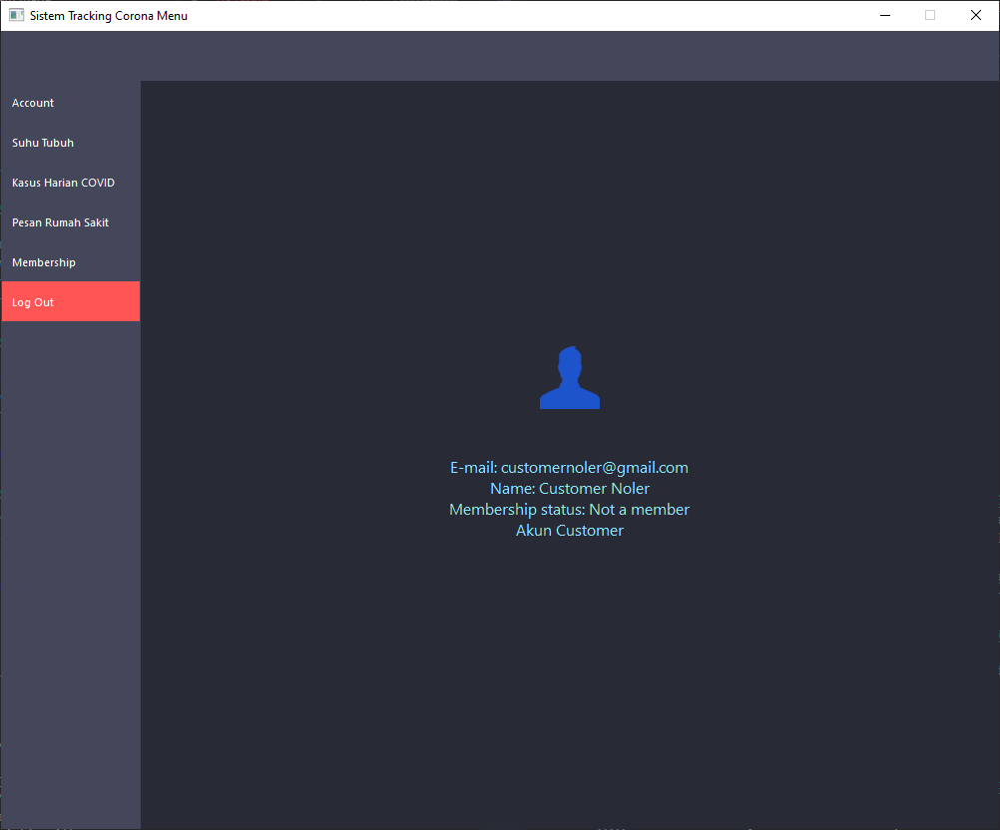
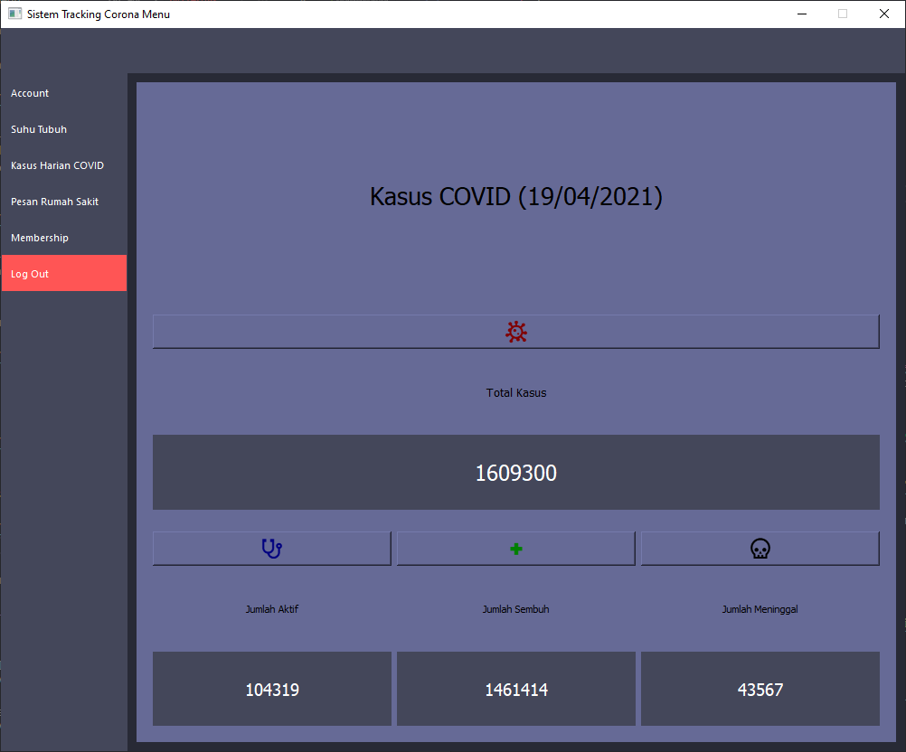
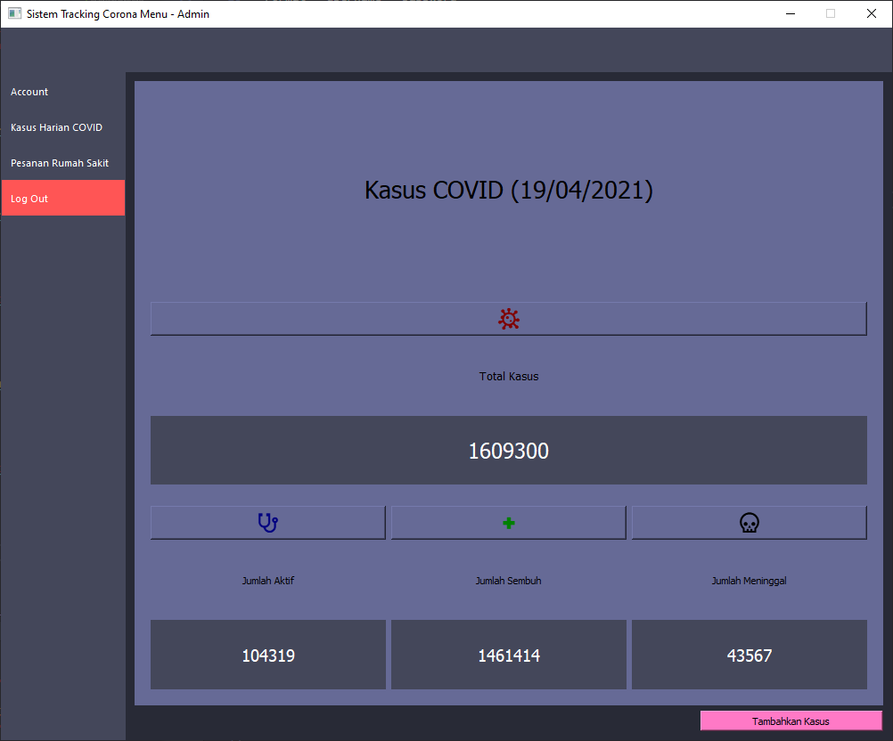

# IF2250-2021-K03-G03-Sistem Tracking Corona

## Deskripsi

Sistem Tracking Corona adalah sebuah aplikasi dekstop untuk platform OS Windows. Pengguna yang ingin menggunakan aplikasi ini harus register/mendaftarkan untuk membuat akun terlebih dahulu lalu dilanjutkan dengna login. Terdapat 3 jenis pengguna yang dapat menggunakan aplikasi ini yaitu customer/pelanggan dan admin yang masing-masing memiliki tampilan utama yang berbeda untuk mengakomodasi fungsionalitas yang dapat digunakan oleh tiap jenis akun. Customer dapat melihat kasus harian corona, mendaftarkan untuk menjadi member, memasukkan suhu tubuh harian mereka, dan memesan rumah sakit. Sedangkan admin dapat mengulas pemesanan yang dibuat oleh customer dan memperbarui database kasus harian yang akan dilihat oleh customer. Selain itu, juga terdapat customer yang terdaftar sebagai member setelah membeli membership.

## Instalasi Aplikasi

1. Unduh artifact dari job terbaru pada pipeline gitlab

2. Extract zip yang telah diunduh

3. Jalankan aplikasi CoronaApp.exe

## Menjalankan Aplikasi

1. Jalankan CoronaApp.exe

2. Setelah dijalankan, akan muncul dialog login seperti berikut:
     
    

3. Jika sudah memiliki akun, maka dapat langsung memasukkan email dan password yang benar untuk login, jika belum maka dapat menekan tombol Register (kuning) untuk mendaftarkan akun, tampilan Register akan terlihat seperti berikut ini:
     
    

4. Jika sudah register dan/atau login, maka akan terlihat menu utama sesuai dengan tipe akun yang dimiliki, tampilannya adalah sebagai berikut.

5. Tampilan menu utama untuk customer
     
    

5.1 Tampilan Suhu Tubuh untuk customer
     
    

5.2 Tampilan Kasus Harian COVID untuk customer
     
    

5.3 Tampilan Pemesanan Rumah Sakit untuk customer
     
    

5.4 Tampilan Pembelian Membership untuk customer
     
    

6. Tampilan menu utama untuk admin
     
    

6.1 Tampilan Mengulas Pesanan Rumah Sakit untuk Admin
     
    

6.2. Tampilan Kasus Harian COVID untuk Admin
     
    

## Modul yang digunakan

1. Main Menu

2. Login

3. Suhu Tubuh

4. Input Suhu Tubuh

5. Riwayat Suhu Tubuh

6. Kasus Harian COVID

7. Menampilkan Kasus Harian

8. Update Kasus Harian (Admin)

9. Pemesanan Rumah Sakit

10. Pemilihan Rumah Sakit

11. Hasil Review Admin

12. Review Pemesanan Pengguna (Admin)

13. Membership

14. Mengecek Membership

15. Mengaktifkan Membership

## Basis Data Yang Digunakan

1. t_akun

1.1 user_id

1.2 name

1.3 email

1.4 password

1.5 role

1.6 number

2. t_customer

2.1 user_id

2.2 membership_status

2.3 PIN

3. t_harian

3.1 tanggal

3.2 kasus_total

3.3 jumlah_aktif

3.4 jumlah_sembuh

3.5 jumlah_meninggal

4. t_prs

4.1 order_id

4.2 user_id

4.3 rs_id

4.4 timestamp_pesan

4.5 timestamp_review

4.6 timestamp_pembayaran

4.7 nominal_pembayaran

5. t_rs

5.1 rs_id

5.2 nama_rs

5.3 alamat_rs

5.4 status

6. t_suhu

6.1 user_id

6.2 tanggal

6.3 suhu
